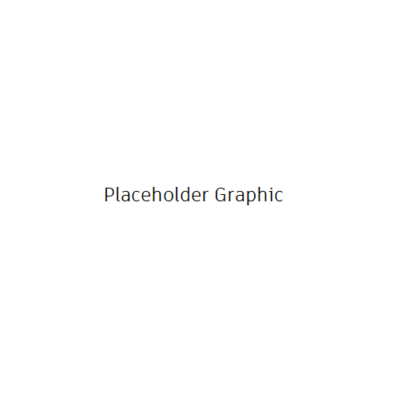

Breakdown2 API Reference
########################

Overview
********

tk-multi-breakdown2 (Breakdown2) is a customizable Toolkit App that allows studios to manage the behaviour when referencing PublishedFiles within a DCC Engine. It is meant to be a replacement for the original tk-multi-breakdown Application.

Improvements beyond the original Breakdown App
==============================================

* Ability to manage references in multiple Shotgun Projects

Default configuration behaviour
===============================

Customizations
==============

.. toctree::
    :maxdepth: 2

    api
    engine-specific-notes
